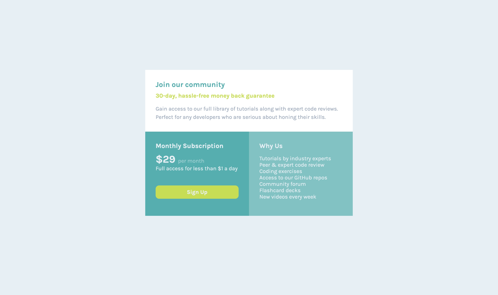

# Frontend Mentor - Single price grid component solution

This is a solution to the [Single price grid component challenge on Frontend Mentor](https://www.frontendmentor.io/challenges/single-price-grid-component-5ce41129d0ff452fec5abbbc). Frontend Mentor challenges help you improve your coding skills by building realistic projects. 

## Table of contents

- [Overview](#overview)
  - [The challenge](#the-challenge)
  - [Screenshot](#screenshot)
- [My process](#my-process)
  - [Built with](#built-with)
  - [What I learned](#what-i-learned)
  - [Useful resources](#useful-resources)
- [Author](#author)

## Overview

### The challenge

Users should be able to:
- View the optimal layout for the component depending on their device's screen size
- See a hover state on desktop for the Sign Up call-to-action

### Screenshot




## My process

### Built with

- Semantic HTML5 markup
- CSS custom properties
- CSS Flexbox
- CSS Grid
- Media queries

### What I learned

This is the first time I've written code using CSS Grid. I was able to put into practice my knowledge of grid, and also learned about the minmax function. It was challenging but so much fun. I also experimented with box shadows and text shadow to create hover effects on the "Sign up" button. 


```css
@media (min-width: 768px) {

    .container {
        display: grid;
        grid-template-columns: repeat(2, minmax(0, 1fr));
    }

    .first-column {
        grid-column: 1 / 3;
    }

    .second-column {
        grid-column: 1 / 2;
    }

    .third-column {
        grid-column: 2 / 3;
    }
}

a:hover {
    text-shadow: .1rem .1rem .5rem var(--GrayishBlue);
    box-shadow: 0 .1rem .2rem .1rem var(--ShadowCyan);
}

```

### Useful resources

-[Complete Guide to CSS Grid](https://css-tricks.com/snippets/css/complete-guide-grid/) 

## Author

- Frontend Mentor - [@esgave](https://www.frontendmentor.io/profile/esgave)